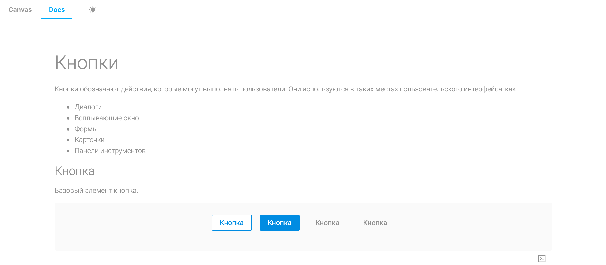
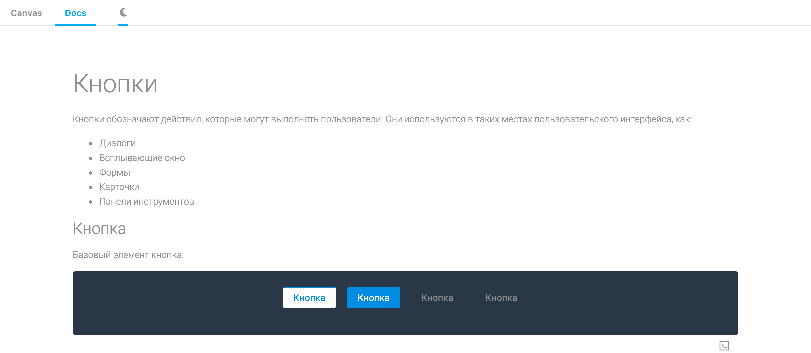

# @pobedit/storybook-theme-switcher-addon

This addon can be used to switch themes of stories in [Storybook](https://storybook.js.org/).


## Getting Started

Install this addon by adding the @storybook/addon-links dependency:






```sh
yarn add -D @pobedit/storybook-theme-switcher-addon
```

within `.storybook/addons.ts`:

```js
import '@pobedit/storybook-theme-switcher-addon/register';
```

within `.storybook/config.tsx`:

```js
import {configure, addDecorator} from '@storybook/react';

addDecorator(withTheme);
```

within your component:

```typescript
import React, {PureComponent} from 'react';
import { ThemeContext, ThemeColor } from '@pobedit/storybook-theme-switcher-addon'; import {background} from '@storybook/theming';

export enum Color {
    dark = '#2B3648',
    light = '#fafafa'
}

class StoryWrapper extends PureComponent<null> {
    static contextType: React.Context<string> = ThemeContext;

    render() {
        return <div style={{backgroundColor: ThemeColor[this.context]}}> { YOUR_STORY } </div>;
    }
}
```
